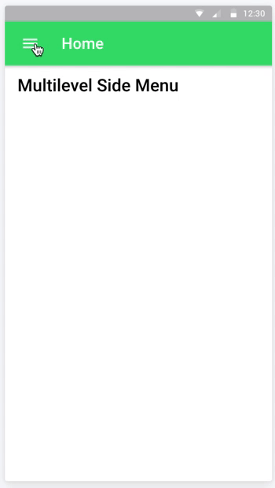

# Multi-level Side Menu [](https://github.com/ellerbrock/open-source-badges/)

Ionic 3 demo of a two-level side menu. The component currently supports only two levels of items. If more levels are needed, maybe using tabs layout for the other levels would be a better approach. 

The component also supports two different modes: **accordion** and **default**.

<p>
  
  
</p>


# Table of contents

* [Ionic info](#ionic-info)
* [Running the demo](#running-the-demo)
* [Using the component in your projects](#using-the-component-in-your-projects)
* [Features](#features)
    * [Items structure](#items-structure)
    * [Selecting options](#selecting-options)
    * [Settings](#settings)
    * [Some other public methods](#some-other-public-methods)
    * [Theming](#theming)
    * [Navigation outside the side menu](#navigation-outside-the-side-menu)
        * [SideMenuDisplayText](#sidemenudisplaytext)
        * [SideMenuDisplayTextConditions](#sidemenudisplaytextconditions)
        * [SideMenuOptionSelect with SideMenuOptionSelectData](#sidemenuoptionselect-with-sidemenuoptionselectdata)
* [Changelog](#changelog)
* [Roadmap](#roadmap)
* [Contribution](#contribution)
* [Support this project](#support-this-project)

# Ionic info

```
Cli packages: (/usr/local/lib/node_modules)

    @ionic/cli-utils  : 1.19.0
    ionic (Ionic CLI) : 3.19.0

Local packages:

    @ionic/app-scripts : 3.1.7
    Ionic Framework    : ionic-angular 3.9.2

```

# Running the demo

Inside of the project folder, run `npm install` and then to run the demo in the browser `ionic serve [-t android/ios]`

## Using the component in your projects

Just copy the `side-menu-content` folder (inculding the html, ts and scss files) in your project. Then include the `SideMenuContentComponent` in the `declarations` array from your `@NgModule`.

# Features

## Items structure

Options and suboptions should be of type `SideMenuOption`:

```
export interface SideMenuOption {
    iconName?: string;
    displayText: string;
    badge?: Observable<any>;
    component?: any;
    custom?: any;
    selected?: boolean;
    suboptions?: Array<SideMenuOption>;
}
```

Property | Type | Description
--- | --- | ---
`iconName` | `string` | **Optional**. Name of the *Ionic icon* to be used for this option/suboption. If it is an option with suboptions and the `iconName` is null, the default icon will be `ios-arrow-down`
`displayText` | `string` | Text to be shown in the menu
`badge` | `Observable<any>` | **Optional**. `Observable` that allows the application to dynamically update the value of the badge
`component` | `any` | **Optional**. Target component or `null` if it is a *special option/suboption* (this would mean that it does not change the current page, so it may be related to login/logout options, or to changing the current language, ...)
`custom` | `any` | **Optional**. Property to pass whatever we need. That way we can access this property when the user selects this option/suboption and handle login/logout options, changing the language, ...
`selected` | `boolean` | **Optional**. If `true`, the option/suboption will be marked as selected by default
`suboptions` | `Array<SideMenuOption>` | **Optional**. List of suboptions of the option. Each suboption should be of type `SideMenuOption`

So an option with nested suboptions would look like this:

```
let menuOption: SideMenuOption = {
    displayText: 'Option Name',
    suboptions: [
        {
            // With icon
            iconName: 'ios-basket',
            displayText: 'Sub Option 1',
            component: 'SomePage'
        },
        {
            // Without icon
            displayText: 'Sub Option 2',
            component: 'SomeOtherPage'
        },
        {
            // Special option with icon
            iconName: 'log-in',
            displayText: 'Login',
            custom: {
                isLogin: true
            }
        },
        {
            // Another special option but without icon
            displayText: 'Spanish',
            custom: {
                shouldChangeLanguage: true,
                targetLanguage: 'ES'
            }
        }
    ]
};
```

## Selecting options

When an option is selected, the `SideMenuOption` object is returned to the caller by the `change` event. The `SideMenuOption` returned object can then be used to check if we need to push/set as root a new page, or if we need to handle that option as a *special option*.

```
<side-menu-content [options]="options" (change)="onOptionSelected($event)"></side-menu-content>
```

And then in the App component code:

```
@Component({
    templateUrl: 'app.html'
})
export class MyApp {
    // ...

    public onOptionSelected(option: SideMenuOption): void {
        if (option.custom && option.custom.isLogin) {
            // Handle the login...
        } else if (option.custom && option.custom.isLogout) {
            // Handle the logout...
        } else if(option.component) {
            // Push or set as root the option.component page
        }
    }
}
```

## Settings

The component also defines the `SideMenuSettings` interface, to customize the behaviour of the component.

```
export interface SideMenuSettings {
    accordionMode?: boolean;
    optionHeight?: {
        ios?: number,
        md?: number,
        wp?: number
    };
    arrowIcon?: string;
    showSelectedOption?: boolean;
    selectedOptionClass?: string;
    indentSubOptionsWithoutIcons?: boolean;
    subOptionIndentation?: {
        ios?: number,
        md?: number,
        wp?: number
    };
}
```

The settings should be sent to the component using the `settings` property:

```
@Component({
    templateUrl: 'app.html'
})
export class MyApp {
	
    //...

    // Settings for the SideMenuContentComponent
    public sideMenuSettings: SideMenuSettings = {
        accordionMode: true,
        showSelectedOption: true,
        selectedOptionClass: 'my-selected-option'
    };

    // ...

} 
```

And in the view:

```
<side-menu-content [settings]="sideMenuSettings" [options]="options" (change)="onOptionSelected($event)"></side-menu-content>
```

Param | Description | Default value
--- | ---| ---
`accordionMode` | **Optional**. If `true`, all options will be collapsed before expanding the new selected option | `false`
`optionHeight` | **Optional**. Custom height (in pixels) to be used for each option/suboption | `50` for all `md`, `ios` and `wp`
`arrowIcon` | **Optional**. Name of the *Ionic icon* to be used as the arrow in options that contain suboptions | `ios-arrow-down`
`showSelectedOption` | **Optional**. If `true`, the selected option will be highlighted | `false`
`selectedOptionClass` | **Optional**. Name of the class to be added to the selected option. Only used when `showSelectedOption` is `true` | `selected-option` 
`indentSubOptionsWithoutIcons` | **Optional**. If `true`, suboptions without icons will be vertically aligned based on the parent option | `false`
`subOptionIndentation`| **Optional**. Left `padding` (in pixels) to be used on each suboption, so we can indent them if needed | `16` for all `md`, `ios` and `wp`


## Some other public methods

The component also exposes a `collapseAllOptions()` method to reset the state of the options when needed (after selecting an option, or when closing the side menu for example):

```
@Component({
    templateUrl: 'app.html'
})
export class MyApp {
    // Get the instance to call the public methods
    @ViewChild(SideMenuContentComponent) sideMenu: SideMenuContentComponent;

    // ...

    public selectOption(option: SideMenuOption): void {
        this.menuCtrl.close().then(() => {

            // Collapse all the options
            this.sideMenu.collapseAllOptions();
            
            // ...
        
        });
    }
}
```

## Theming

We can use some simple css rules to change the styles of the menu options. If we set the `showSelectedOption` setting to `true`, we can also set the styles of the options when they are marked as selected.

Target | Class name
--- | ---
Basic option (options without suboptions) | `option` 
Option with suboptions | `header` 
Suboption | `sub-option` 

So for instance, we can use the following css rules (by adding it in the `app.scss` file) to change the color of the menu items, both when they are selected and when they're not:

```
side-menu-content {

    // In this example, we have used the following name
    // for the selected option in the settings object:
    // selectedOptionClass: 'active-side-menu-option'

    $active-color: map-get($colors, primary);
    $font-color: #222;
    $background-light-color: #fff;
    $background-dark-color: #eee;

    // Single option
    // ------------------
    ion-item.item.item-block.option {
        background-color: $background-light-color;
        color: $font-color;

        &.active-side-menu-option {
            color: $active-color;
            font-weight: 700;
        }
    }

    // Header
    // ------------------
    ion-item.item.item-block.header {
        background-color: $background-dark-color;
        color: $font-color;

        &.active-side-menu-option {
            color: $active-color;
            font-weight: 700;
        }
    }

    // Sub option
    // ------------------
    ion-item.item.item-block.sub-option {
        background-color: $background-light-color;
        color: $font-color;

        &.active-side-menu-option {
            color: $active-color;
            font-weight: 700;            
        }
    }
}
```

## Navigation outside the side menu

If we set the `showSelectedOption` setting to `true`, and then we try to navigate to a given page using a button on the content on the page **instead of clicking on that option from the side menu**, that page won't be shown as selected in the menu. 

In order to avoid this issue we can use:</br>
a) The `SideMenuDisplayText` decorator.</br>
b) The `SideMenuDisplayTextConditions` decorator.</br>
c) The `SideMenuOptionSelect` event sending the `SideMenuOptionSelectData`.</br>

**Important**: If we want to use the `SideMenuDisplayText` or the `SideMenuDisplayTextConditions` decorators, first we would need to make the injector to be available in the entire module by changing the following line of the `app.module.ts` file:

```
export class AppModule { }
```

and replace it by the following code:

```
export class AppModule {
  static injector: Injector;
  constructor(injector: Injector) { AppModule.injector = injector; }
}
```

### `SideMenuDisplayText`

This custom decorator allows each page to define which option from the side menu should be marked as selected when the page is opened.

`@SideMenuDisplayText(displayText: string)`.

The `displayText` parameter is **mandatory** and should be equal to the `displayText` property from the option that should be marked as selected when the user enters to this page. 

So if in the `app.component.ts` file we created the option like this:

```
// ...
this.options.push({
    iconName: 'home',
    displayText: 'Home', // <-- The displayText property of this option is 'Home'
    component: 'HomePage',
});
// ....
```
Then in the page we will use the `SideMenuDisplayText` decorator like this:

```
@IonicPage()
@Component({
    selector: 'page-home',
    templateUrl: 'home.html'
})
@SideMenuDisplayText('Home') // <-- We need to set this parameter to 'Home' as well
export class HomePage {
    // ...
}
```

### `SideMenuDisplayTextConditions`

The previous decorator works properly but only if **each page is related to only one option** from the side menu (since the decorator is being set per page). But what happens if the same page is related to more than one option from the side menu?

For example, in this demo project we have a `EmailsPage` page/component that receives a parameter `showDeleted: boolean`. Based on that parameter, the page shows the inbox or the deleted messages from the user. Both *Inbox* and *Bin* are also options being shown in the side menu.

So basically two different options from the side menu are related to the same page. In this scenario, we can use the `SideMenuDisplayTextConditions` decorator to select the right option from the side menu based on a given **condition**.

`SideMenuDisplayTextConditions(conditions: Array<SideMenuOptionSelectCondition>)`

The `conditions` parameter is mandatory and should be an array of `SideMenuOptionSelectCondition` entities. Each condition tells the component how to check which option should be marked as selected (if any).

So if in the `app.component.ts` file we created the options like this:

```
// ...
this.options.push({
    displayText: 'Same component',
    suboptions: [
        {
            iconName: 'mail',
            displayText: 'Inbox',
            component: 'EmailsPage', // <-- Both options are related the same EmailsPage component
            custom: {
                param: { showDeleted: false }
            }
        },
        {
            iconName: 'trash',
            displayText: 'Bin',
            component: 'EmailsPage', // <-- Both options are related the same EmailsPage component
            custom: {
                param: { showDeleted: true }
            }
        }
    ]
});
// ....
```

Then in the page we will use the `SideMenuDisplayTextConditions` decorator like this:

```
@IonicPage({
    segment: 'emails/:showDeleted'
})
@Component({
    selector: 'page-emails',
    templateUrl: 'emails.html'
})
@SideMenuDisplayTextConditions([ // <-- Here we set an array of conditions!
    { propertyName: 'showDeleted', matcher: Matcher.ToBeFalsy, displayText: 'Inbox' },
    { propertyName: 'showDeleted', matcher: Matcher.ToBeTruthy, displayText: 'Bin' }
])
export class EmailsPage {

    public showDeleted: boolean;

    constructor(private navParams: NavParams) { }

    ionViewWillEnter() {
        // We initialize the showDeleted property so it can be ready
        // to be used in the SideMenuDisplayTextConditions decorator
        this.showDeleted = this.navParams.get('showDeleted');
    }
}
```

Each *condition* should be of type `SideMenuOptionSelectCondition`:

```
export interface SideMenuOptionSelectCondition {
    propertyName: string;
    value?: any;
    matcher: Matcher;
    displayText: string;
}
```

Param | Description
--- | ---
`propertyName` | Name of a property from the page/component to check its value against the `value` property
`value` | **Optional**. Value that the property with name `propertyName` should have mark this option as selected
`matcher` | Defines how should the value from `propertyName` be checked to figure out if the condition is satisfied
`displayText` | The `displayText` of the option/suboption from the side menu that should be marked as selected if the condition is satisfied

The `Matcher` *enum* includes the following values:

Value | Description
--- | ---
`ToBe` | Expects the current value to be == to the expected value
`NotToBe` | Expects the current value to be != to the expected value
`ToEqual` | Expects the current value to be === to the expected value
`NotToEqual` | Expects the current value to be !== to the expected value
`ToBeDefined` | Expects the current value to be defined (not `undefined`)
`ToBeFalsy` |  Expects the current value to be falsy
`ToBeGreaterThan` | Expects the current value to be greater than the expected value
`ToBeGreaterThanOrEqual` | Expects the current value to be greater than or equal to the expected value
`ToBeLessThan` | Expects the current value to be less than the expected value
`ToBeLessThanOrEqual` | Expects the current value to be less than or equal to the expected value
`ToBeNull` | Expects the current value to be `null`
`ToBeTruthy` | Expects the current value to be truthy
`ToBeUndefined` | Expects the current value to be `undefined`
`ToContain` | Expects the current value to contain a specific value
`ToMatch` | Expects the current value to match a regular expression

### `SideMenuOptionSelect` with `SideMenuOptionSelectData`

If we need to select an option based on a more complex logic, we can still use the `SideMenuOptionSelect` event to let the side menu component know which option should be marked as selected. This component defines and makes available a `SideMenuOptionSelect` event and the `SideMenuOptionSelectData` interface:

```
export const SideMenuOptionSelect: string = 'sideMenu:optionSelect';
export interface SideMenuOptionSelectData { displayText?: string; }
```

So in the page we just need to publish that event using **[Ionic Events](https://ionicframework.com/docs/api/util/Events/)**:

```
@Component({
    selector: 'page-demo',
    templateUrl: 'demo.html'
})
export class DemoPage {
    constructor(private eventCtrl: Events, ...) { }

    ionViewWillEnter() {
        const complexResult = this.someComplexMethod();

        if(complexResult % 2 === 0) {
            this.selectOptionByName('Option 2');
        } else {
            this.selectOptionByName('Option 1');
        }
    }

    private someComplexMethod(): number {
        return Math.floor(Math.random() * 10);
    }

    private selectOptionByName(name: string): void {
        const data: SideMenuOptionSelectData = { displayText: name };
        this.eventCtrl.publish(SideMenuOptionSelect, data);
    }
}
```

# Changelog

 * **19/04/2018** Added `SideMenuDisplayText` and `SideMenuDisplayTextConditions` custom decorators. That way the right option can be selected when refresing the page (see [this issue](https://github.com/sebaferreras/Ionic3-MultiLevelSideMenu/issues/21)). Created **lazy-loaded pages** for every option of the demo.

    ### **🔥 ⚠️️️ Breaking changes ⚠️️️ 🔥**

    **Some interfaces and properties were renamed from the previous version**. So if you're updating this demo project from the previous version, please take a look at the **[breaking changes](https://github.com/sebaferreras/Ionic3-MultiLevelSideMenu/blob/master/BREAKING_CHANGES.md)** section.

* **06/01/2018**: Added support for `ion-badge` in the items/sub-items. The `badge` option expects an `Observable` that allows the application to dynamically update the value of the badge (**thanks [@ralscha](https://github.com/ralscha)!!**). Updated Ionic to the `3.9.2` version (**thanks [@peterennis](https://github.com/peterennis)!!**)<br>

* **04/11/2017**: Added `option`, `header` and `sub-option` classes to style the options (see `Theming` section for more details). Improved overall performance by removing direct access to the DOM.<br>

* **30/08/2017**: Added `showSelectedOption` and `selectedOptionClass` to highlight the currently selected option. Added `custom` subproperty in the `SideMenuOption` model to allow the user to add any custom property on the items.<br>

* **16/09/2017**: Added `indentSubOptionsWithoutIcons` and `subOptionIndentation` settings to allow the user to customize the indentation of the sub items. Improved inner logic so now if the `showSelectedOption` setting is `true` and the currently selected option is a sub item, its parent will be shown expanded when opening the side menu.<br>

# Roadmap

- Convert this demo into an *npm package*
- Add unit testing
- Add e2e testing

# Contribution
- Having an **issue** or looking for **support**? [Open an issue](https://github.com/sebaferreras/Ionic3-MultiLevelSideMenu/issues/new) and I'll do my best to help you out.
- Got a **new feature or a bug fix**? Fork the repo, make your changes, and submit a pull request.

# Support this project
If you find this project useful, please star the repo to let people know that it's reliable. Also, share it with friends and colleagues that might find this useful as well. Thank you! :)